```mermaid
flowchart LR
    browser[Browser webcam<br/>native FPS] -->|WebRTC offer/answer| api[FastAPI /webrtc/offer]
    api --> track[IncomingVideoTrack]
    track --> slot[FrameSlot<br/>latest frame only]
    slot --> loop[InferenceLoop<br/>cadence controlled]
    loop --> adapter[Cosmos via vLLM<br/>or mock in tests]
    adapter --> result[Structured TrafficEvent<br/>vlm_summary/reasoning/model]
    result --> sse[GET /live/results SSE]
    sse --> overlay[Browser overlay]
```

# Urban Edge Vision Analytics

Edge vision inference and traffic event observability for smart intersections.

This project turns camera frames, vehicle detections, and flow analytics into structured traffic events that an operator can review. The goal is not automated enforcement. The goal is infrastructure intelligence with human-reviewed incident management.

---

## Core Stack

**Implemented:** Python · FastAPI · Pydantic · mock detection adapter · synthetic frame source · flow analytics · Pytest

**Planned / integration path:** OpenCV · ONNX Runtime · TensorRT · RTSP source · Jetson benchmark artifact

<p>
  
  
  
  
  
  
  
</p>

---

## Architecture and Evidence

- [Architecture overview](docs/architecture.md)
- [System architecture diagram](docs/diagrams/system-architecture.mmd)
- [Runtime flow diagram](docs/diagrams/runtime-flow.mmd)
- [Data flow diagram](docs/diagrams/data-flow.mmd)
- [Deployment view diagram](docs/diagrams/deployment-view.mmd)
- [Sample outputs](artifacts/sample-outputs/)
- [Logs](artifacts/logs/)
- [Reports](artifacts/reports/)

---

## What Works Now

This repository includes a runnable engineering scaffold:

- Pydantic schemas for inference frames, vehicle detections, traffic events, and incidents
- Mock detection adapter — seeded, deterministic, zero model dependencies
- Synthetic frame source for development and testing
- Sliding flow window analytics: vehicle count, congestion detection, per-class counts
- Inference latency telemetry with p95/p99 tracking
- FastAPI backend: event ingestion, incident lifecycle, runtime metrics
- Operator incident workflow: open → under_review → resolved / dismissed
- Configs for local dev and Jetson Orin deployment planning, validated by `api/config.py`
- Optional edge-to-cloud publishing (`cloud/`), off by default
- Test suite: schemas, flow analytics, event lifecycle, API smoke

---

## Architecture

```text
Camera / Video Source
        |
        v
  Source Loader  ->  Detection Adapter  ->  Flow Analytics  ->  Event Store
        |                   |                     |                  |
   (synthetic,          (Mock / ONNX /       (FlowWindow,       (TrafficEvent,
    video file,          TensorRT /            congestion,        Incident,
    RTSP stream)         NIM endpoint)         class counts)      operator review)
                                                                      |
                                                                      v
                                                               FastAPI Backend
                                                          (events, incidents, metrics)
```



---

## Repository Layout

```text
api/          FastAPI application and routes
vision/       Frame schemas, detection adapter interface, source loaders
events/       Traffic event and incident schemas, event store lifecycle
analytics/    Flow window analytics, congestion detection, pipeline metrics
telemetry/    Inference latency metrics, runtime snapshot, telemetry contract
cloud/        Edge-to-cloud publishers (null, file, IoT Core), envelope contract
configs/      Local and Jetson JSON configs (incl. cloud section)
examples/     Sample payloads
docs/         Architecture and roadmap
tests/        Unit and smoke tests
```

---

## Quick Start

Primary target today: Linux local development with the deterministic mock adapter. Jetson Orin is a planned deployment target after ONNX or TensorRT adapters are implemented and benchmarked.

Use the live engine for real-time monitoring; use the `summarize-recording` CLI / `POST /recordings/{id}/summarize` API for after-the-fact VSS analysis. See [docs/live-vlm-engine-brief.md](docs/live-vlm-engine-brief.md) for the engine architecture.

```bash
git clone https://github.com/obiedeh/urban-edge-vision-analytics.git
cd urban-edge-vision-analytics
python -m venv .venv
source .venv/bin/activate
pip install -e .[dev]
uvicorn api.main:app --reload --port 8080
```

Open:

- API health: `http://127.0.0.1:8080/health`
- OpenAPI docs: `http://127.0.0.1:8080/docs`
- Inference metrics: `http://127.0.0.1:8080/metrics/inference`
- Runtime snapshot: `http://127.0.0.1:8080/runtime`

Browser WebRTC live path:

```bash
uvicorn api.main:app --reload --port 8080
cd web
pnpm dev
```

Open `http://127.0.0.1:3000/live`, allow browser camera access, and watch
the video render directly in the browser while VLM results stream from
`GET /live/results`. The legacy RTSP FFmpeg reader is still available for
one release through `urban-edge-live-pipeline --legacy-ffmpeg`.

---

## Run This Demo

```bash
uvicorn api.main:app --reload --port 8080
python examples/generate_mock_report.py --output examples/mock_inference_report.json
```

The API exposes the operator-facing event workflow, while the mock report shows deterministic frame-analysis evidence without claiming real-camera accuracy.

---

## Docker

```bash
docker build -t urban-edge-vision .
docker run -p 8080:8080 urban-edge-vision
```

---

## Traffic Event Model

Events carry:

- camera ID and timestamp
- event type: `vehicle_detected`, `red_light_violation`, `unsafe_turn`, `congestion_onset`, `congestion_clear`, `wrong_way`
- severity: `info`, `warning`, `critical`
- vehicle count and track IDs
- confidence score
- operator review recommendation
- inference latency and metadata

See `examples/sample_event.json`.

---

## Detection Adapter Strategy

The live runtime selector exposes NVIDIA Cosmos and Gemma VLM presets. See [docs/live-vlm-engine-brief.md](docs/live-vlm-engine-brief.md) §AD-3.

| Selector | Backend | Use |
|---|---|---|
| `cosmos-2b` | vLLM serving `nvidia/Cosmos-Reason2-2B` | Default. Fast, ~200-500ms on RTX 5090. |
| `cosmos-8b` | vLLM serving `nvidia/Cosmos-Reason2-8B` | Heavy tier. ~1-2s, better reasoning. |
| `cosmos-3` | NIM/vLLM serving `nvidia/cosmos3-nano-reasoner` | Cosmos 3 Nano reasoner. Fits RTX 5090 class GPUs with headroom. |
| `gemma-4` | Ollama serving `gemma4:e4b` | Recommended quantized Gemma 4 live starting point. |
| `gemma-4-vllm` | vLLM serving `google/gemma-4-E4B-it` | Official Gemma 4 E4B Hugging Face checkpoint. |
| `gemma-4-26b-nvfp4` | vLLM serving `nvidia/Gemma-4-26B-A4B-NVFP4` | Quantized high-quality Gemma 4 target; dedicate most GPU memory. |
| `vss` | NVIDIA VSS Blueprint endpoint | **Batch-only.** Not in the live UI; used by the `summarize-recording` pipeline. |

OpenAI-compatible chat endpoints are the live-inference path: vLLM/NIM for Cosmos and Ollama or vLLM for Gemma. `MockDetectionAdapter` remains the test default but is not selectable at runtime. `OllamaAdapter` and `NvidiaNimAdapter` classes stay importable for dev/test and local model checks.

The live camera path is split into two layers:

- **Ingress:** Browser-side WebRTC (or RTSP camera profile bridged through the server).
- **Inference:** one selected Cosmos or Gemma VLM served via vLLM/NIM. Recorded video is summarized by VSS in a separate batch pipeline.

The camera transport is independent from the model stack.

---

## Deployment Paths

Local dev (mock adapter):

```bash
uvicorn api.main:app --reload --port 8080
```

Real camera feed validation:

```bash
cp configs/camera.local.example.json configs/camera.local.json
export CAMERA_USERNAME='camera-user'
export CAMERA_PASSWORD='camera-password'
.venv/bin/python -m vision.camera_profiles --config configs/camera.local.json --dry-run
.venv/bin/python -m vision.camera_profiles --config configs/camera.local.json --ffplay
```

Supported `model_type` values are `generic_rtsp`, `hikvision`, `dahua`, `amcrest`, `axis`, `reolink`, `tapo`, `unifi_protect`, and `http_mjpeg`. Use `path` in the JSON config when a camera requires a vendor-specific RTSP path that is not covered by the profile defaults.

To validate camera settings during API startup:

```bash
export CAMERA_CONFIG=configs/camera.local.json
export CAMERA_REQUIRE_FFPLAY=1
uvicorn api.main:app --reload --port 8080
```

Run the live Tapo stream through the current mock vision pipeline and post events to the API:

```bash
export CAMERA_USERNAME='camera-user'
export CAMERA_PASSWORD='camera-password'
.venv/bin/python -m vision.live_pipeline \
  --config configs/camera.local.json \
  --api-url http://127.0.0.1:8080 \
  --sample-fps 1 \
  --frames 10
```

The worker uses the same Tapo RTSP URL validated by `ffplay`, samples frames with FFmpeg, runs the active `DetectionAdapter`, and posts resulting events to `/events`.

Jetson Orin target path after ONNX adapter implementation:

```bash
DETECTION_ADAPTER=onnx uvicorn api.main:app --host 0.0.0.0 --port 8080
```

Do not treat the Jetson command as validated until a real ONNX adapter, model file, and benchmark artifact are committed.

---

## Tests

```bash
PYTEST_DISABLE_PLUGIN_AUTOLOAD=1 pytest
```

For the Linux validation path used by CI:

```bash
make install-dev
make verify
```

The current CI gate runs Ruff linting, type checks, and tests on Ubuntu.

## Mock Evidence Artifact

Generate deterministic synthetic evidence from the mock detection adapter:

```bash
python examples/generate_mock_report.py --output examples/mock_inference_report.json
```

The generated report is committed at `examples/mock_inference_report.json`. It proves the current mock-frame pipeline executes and summarizes detections, class counts, and congestion windows. It does not claim real camera accuracy, Jetson latency, or automated enforcement readiness.

For the reviewer-facing deliverables checklist, see [PORTFOLIO_DELIVERABLES.md](PORTFOLIO_DELIVERABLES.md).

---

## Edge-to-cloud (AWS)

Jetson nodes will publish events, incidents and telemetry to AWS IoT Core;
raw video stays on the device. Publishing is optional, config-driven and off
by default (`cloud.enabled: false`), so the edge app runs with no network and
no AWS account. Design, contract and an offline demo: [docs/cloud-architecture.md](docs/cloud-architecture.md).

| Phase | Scope | Status |
|---|---|---|
| 0 | `cloud/` publisher interface, `NullPublisher` + `FilePublisher` (JSONL), envelope `{schema_version, thing_name, sent_at, kind, payload}` serialized from the Pydantic schemas, wired behind `cloud.enabled` | Done |
| 1 | `IotCorePublisher` (MQTT5, QoS 1, bounded queue, retry/backoff, background thread, fake-client tests), `scripts/provision_device.sh`, optional extra `.[cloud]` | Skeleton done; CDK `infra/iot_stack.py` and a live Jetson run pending |
| 2 | IoT rules to Timestream for InfluxDB, DynamoDB incidents, Firehose to S3, SNS alerts, Athena | Planned |
| 3 | Greengrass v2 component recipes, stream manager store-and-forward | Planned |
| 4 | Managed Grafana dashboard, FastAPI on ECS Fargate behind API Gateway + Cognito | Planned |
| 5 | Fleet indexing, Device Defender, CloudWatch alarms | Optional |

Offline demo in one line (then `tail -f /tmp/urban-edge-cloud.jsonl` and post to `/events`):

```bash
URBAN_EDGE_CLOUD_ENABLED=true URBAN_EDGE_CLOUD_PUBLISHER=file \
URBAN_EDGE_CLOUD_FILE_PATH=/tmp/urban-edge-cloud.jsonl uvicorn api.main:app --port 8080
```

---

## Production Roadmap

1. Add ONNX Runtime adapter (YOLOv8n / RT-DETR-nano) and video file source
2. Benchmark detection latency and throughput on CPU vs GPU
3. Add TensorRT adapter and validate on Jetson Orin hardware
4. Add RTSP source for live camera ingestion
5. Add evidence packaging (frame crops, detection overlays, metadata bundle)
6. Add multimodal incident summarization via local VLM or NVIDIA NIM
7. Add Prometheus metrics endpoint and Grafana deployment profile
8. Add operator review UI or REST-driven review workflow

---

## Positioning

This project supports a broader engineering focus around:

- Edge AI inference
- Physical AI observability
- smart-city traffic analytics
- multimodal AI systems
- Jetson Orin deployment
- operator-facing infrastructure intelligence

---

## Important Note

This project is for operational analysis and infrastructure research.

It is not intended for autonomous legal enforcement or fully automated ticketing systems.
All critical events are flagged for operator review.
