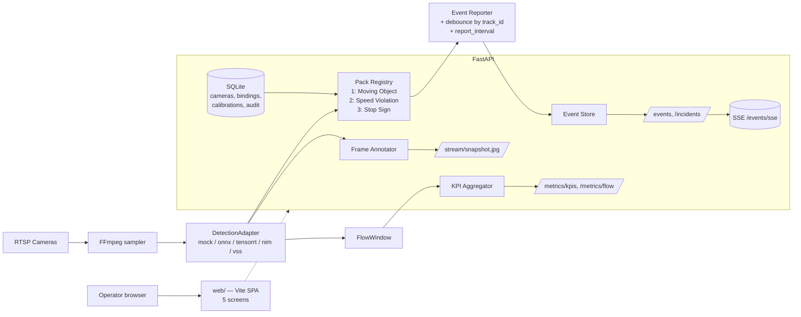

# Operator Wrapper — Implementation Brief

> **Status:** v1.0 — implementation-ready
> **Owner:** Obinna (obiedeh)
> **Targets:** RTX 5090 dev → Jetson Thor AGX prod
> **Date:** 2026-05-21
> **Supersedes:** the single bullet in `docs/roadmap.md` Phase 4 ("Operator review UI or REST-driven review workflow") and the 1500-line PRD v0.3 draft. This brief is intentionally scoped down — no scope creep, no code bloat.

## Goal

Ship a web operator surface for this edge appliance that delivers **three working use case packs** with a compatibility rule, configurable event reporting cadence, and an honest performance/KPI dashboard. Single-site, multi-camera, LAN-only.

## Use case packs — first-class

Three packs are the deliverable. Anything else is out of scope.

| Pack | Detects | Emits |
|---|---|---|
| **1. Moving Object Detection** | Persons in frame | `person_descriptor`, attributes, direction, `track_id`, `detected_at`, `last_seen_at` |
| **2. Speed Violation** | Vehicles exceeding posted speed across two calibrated gates | `vehicle_type`, `vehicle_brand?`, `vehicle_color`, `vehicle_descriptor`, `measured_speed`, `unit`, `posted_speed`, `exceedance`, `direction`, `track_id`, `detected_at` |
| **3. Intersection Stop Sign Compliance** | Vehicles failing to come to a complete stop at a defined stop zone | `decision` (`compliant`/`rolling_stop`/`no_stop`), `min_speed_in_zone`, `dwell_ms`, `vehicle_type`, `vehicle_color`, `vehicle_descriptor`, `direction`, `track_id`, `detected_at` |

### Selection compatibility (locked rule)

| Selection | Allowed? |
|---|:-:|
| `{}` (camera idle) | Yes |
| `{1}`, `{2}`, `{3}` | Yes |
| `{1, 2}` | Yes |
| `{1, 3}` | Yes |
| `{2, 3}` | **No** |
| `{1, 2, 3}` | **No** |

**Why `{2,3}` and `{1,2,3}` are blocked:** Pack 2 needs an oblique, long sight line down a road with two parallel calibration gates spaced for a clean speed fit. Pack 3 needs a near-orthogonal view of a stop bar a few meters away to define a stationary stop zone and measure low-speed dwell. A single camera cannot serve both without measurable degradation. The answer for sites that need both is two cameras (the wrapper already supports per-camera bindings).

Enforced at three layers:
1. **Use Case Studio UI** — disabled toggles in real time with an inline tooltip
2. **`PUT /cameras/{id}/bindings`** — returns HTTP 422 `error: incompatible_pack_selection` with the allowed sets in the body
3. **Audit table** — every `from_set → to_set` change persisted

### Report interval (locked rule)

Each binding carries `report_interval_seconds: int >= 2`, default 5. Hard floor of 2.

- **Pack 1 (continuous):** consolidated state report every `report_interval_seconds` while the target is in frame; final report on track loss.
- **Packs 2 & 3 (decisional):** consolidated event fires once on decision finalize (gate crossed / stop zone exited). The interval acts as a **debounce floor** for repeated decisions on the same `track_id`.

Values < 2 rejected at API save with HTTP 422.

## Out of scope (do not build)

- Multi-site / fleet view
- SSO / OIDC / Keycloak / multi-tenant
- WebRTC and MJPEG transports — snapshot only at MVP
- Audit log screen, settings screen, login screen (single-user LAN), site health screen (merge into Metrics)
- PDF export, CSV export beyond what the table already supports
- Saved reports, scheduled reports, time-series Reports page
- Schedules per binding, alert routing, webhook channels, sound routing
- Multi-role auth (RBAC) — no auth at MVP
- VLM-driven brand recognition for Pack 2 — `vehicle_brand: null` at MVP
- VLM-driven person descriptor for Pack 1 — heuristic (color bucket + size estimate) at MVP
- DuckDB rollups, Prometheus exposition, Grafana profile
- Demo data replay mode
- Camera CRUD UI — camera config stays in `configs/camera.local.json` files; admin reloads via API
- Autonomous enforcement of any kind (per `AGENTS.md`)

These items are documented in this brief's **Future Scope** section as deliberate deferrals.

## Operating discipline

- One new top-level dir: `web/`. Vite + React + TypeScript + Tailwind + shadcn/ui. **No Node runtime ships in the production image** — build SPA on amd64 build stage, copy `dist/` into the existing aarch64 Dockerfile.
- Backend code stays consistent with `AGENTS.md`: Pydantic v2, no OpenCV/ONNX in core modules, mock adapter is the test default.
- New deps limited to: `aiosqlite` (config store), `weasyprint`-free build (no PDF export), `sse-starlette` for the event push.
- `ruff check .` and `pytest -q` green before each commit. `pnpm build` green before any web commit.
- No commit trailers, no AI attribution.
- 3 commits — see Implementation Order.

---

## Architecture (single FastAPI process)



One process. Snapshot-only video. SSE-only push (no WebSocket).

---

## 1. Backend additions

### 1.1 Event schemas — extend `events/schemas.py`

Add three new event types and three new event subclasses to the existing `TrafficEvent` hierarchy. Keep the existing enum values intact; we just add to it.

```python
class EventType(StrEnum):
    # existing
    vehicle_detected = "vehicle_detected"
    red_light_violation = "red_light_violation"
    unsafe_turn = "unsafe_turn"
    congestion_onset = "congestion_onset"
    congestion_clear = "congestion_clear"
    wrong_way = "wrong_way"
    # new (this brief)
    person_activity = "person_activity"
    speed_violation = "speed_violation"
    stop_sign_violation = "stop_sign_violation"


class VehicleType(StrEnum):
    car = "car"
    truck = "truck"
    motorcycle = "motorcycle"
    bus = "bus"
    van = "van"
    bicycle = "bicycle"
    other = "other"


class Direction(BaseModel):
    compass: Literal["N","NE","E","SE","S","SW","W","NW"] | None = None
    heading_deg: float | None = None
    velocity_px_per_s: float | None = None


# Pack 1 — Moving Object Detection
class MovingObjectEvent(TrafficEvent):
    event_type: Literal[EventType.person_activity] = EventType.person_activity
    target_kind: Literal["person"] = "person"
    person_descriptor: str
    attributes: dict  # color_top, color_bottom, size_estimate (heuristic at MVP)
    direction: Direction
    track_id: str
    detected_at: datetime
    last_seen_at: datetime


# Pack 2 — Speed Violation
class SpeedViolationEvent(TrafficEvent):
    event_type: Literal[EventType.speed_violation] = EventType.speed_violation
    target_kind: Literal["vehicle"] = "vehicle"
    vehicle_type: VehicleType
    vehicle_brand: str | None = None  # null at MVP
    vehicle_color: str
    vehicle_descriptor: str
    measured_speed: float
    unit: Literal["mph", "kph"]
    posted_speed: float
    exceedance: float
    direction: Direction
    track_id: str
    detected_at: datetime


# Pack 3 — Stop Sign Compliance
class StopSignEvent(TrafficEvent):
    event_type: Literal[EventType.stop_sign_violation] = EventType.stop_sign_violation
    target_kind: Literal["vehicle"] = "vehicle"
    decision: Literal["compliant", "rolling_stop", "no_stop"]
    min_speed_in_zone: float
    dwell_ms: int
    vehicle_type: VehicleType
    vehicle_color: str
    vehicle_descriptor: str
    direction: Direction
    track_id: str
    detected_at: datetime
```

### 1.2 Pack registry — new module `packs/`

New top-level dir alongside `vision/` etc. Holds the registry and the three packs.

```
packs/
  __init__.py
  base.py            # Pack protocol + ReportWindow
  registry.py        # discovery, binding load/save
  compatibility.py   # the §11.4 rule (allowed/blocked sets)
  moving_object.py   # Pack 1
  speed_violation.py # Pack 2 + speed calibration math
  stop_sign.py       # Pack 3 + dwell math
```

Pack protocol:

```python
class PackId(StrEnum):
    moving_object = "moving_object"
    speed_violation = "speed_violation"
    stop_sign = "stop_sign"


class Pack(Protocol):
    pack_id: PackId
    version: str
    parameters: type[BaseModel]   # Pydantic schema for thresholds/zones
    requires: set[str]            # e.g. {"speed_calibration"} or {"stop_zone"}

    def evaluate(
        self,
        detections: list[Detection],
        flow: FlowWindow,
        config: BaseModel,
        window: ReportWindow,      # respects report_interval_seconds
    ) -> Iterable[TrafficEvent]: ...
```

Compatibility module:

```python
ALLOWED_SETS: set[frozenset[PackId]] = {
    frozenset(),
    frozenset({PackId.moving_object}),
    frozenset({PackId.speed_violation}),
    frozenset({PackId.stop_sign}),
    frozenset({PackId.moving_object, PackId.speed_violation}),
    frozenset({PackId.moving_object, PackId.stop_sign}),
}

def validate_pack_set(packs: Iterable[PackId]) -> None:
    if frozenset(packs) not in ALLOWED_SETS:
        raise IncompatiblePackSelection(...)
```

### 1.3 Config store — `store/` module + SQLite

```
store/
  __init__.py
  schema.sql        # cameras, zones, bindings, calibrations, audit
  config_store.py   # async via aiosqlite
```

Tables (no migrations framework; one `schema.sql` applied at startup if not present):

- `cameras(id, name, profile, rtsp_url, sample_fps, detection_adapter, timezone, enabled, retention_days)`
- `zones(id, camera_id, name, polygon_json, kind)`
- `bindings(id, camera_id, pack_id, parameters_json, report_interval_seconds, enabled, version, updated_at)` — UNIQUE constraint `(camera_id, pack_id)` so the compatibility check stays consistent
- `speed_calibrations(id, camera_id, gate_a_json, gate_b_json, real_world_distance_m, homography_json, captured_at)`
- `stop_zones(id, camera_id, polygon_json, approach_direction, compliance_threshold_json)`
- `audit(id, action, target_kind, target_id, payload_json, created_at)` — append-only, single-table; no UI surface at MVP

### 1.4 Snapshot video transport — new module `transports/snapshot.py`

Annotator → JPEG frames (~1 FPS for grid, ~5 FPS for detail). Single endpoint, cache-busted by timestamp. No WebRTC or MJPEG at MVP.

### 1.5 Event reporter / debouncer

Lives inside `packs/base.py` or new `events/reporter.py`. Holds in-memory state of `(camera_id, track_id, pack_id) → last_emit_ts`. Pack 1 emits state per interval while track is alive; Packs 2/3 emit once per decision and suppress repeats within the interval.

---

## 2. Frontend (web/) — five screens, no more

Vite + React + TypeScript + Tailwind + shadcn/ui.

### 2.1 File layout

```
web/
  app/
    routes.tsx
    pages/
      live.tsx            # S1
      camera-detail.tsx   # S2 (extension of live)
      events.tsx          # S3
      use-case-studio.tsx # S6 (numbered to match the PRD draft)
      metrics.tsx         # S12 — Metrics & KPIs
      artifacts.tsx       # S13 — Evidence Artifacts
  components/
    ui/                   # shadcn primitives
    pack-toggle-grid.tsx  # the §11.4 compatibility grid
    zone-editor.tsx       # polygon editor for stop zones / ROI
    speed-calibration-wizard.tsx
    citation-card.tsx     # reused for evidence drawer
    data-source-badge.tsx # mock / live-rtsp / validated-benchmark
    credibility-banner.tsx
  lib/
    api.ts                # fetch client
    sse.ts                # event stream
    utils.ts              # shadcn cn() helper
  package.json
  tsconfig.json
  vite.config.ts
  tailwind.config.ts
  postcss.config.js
  components.json
  .env.local.example
  .gitignore
```

### 2.2 Five screens — acceptance criteria

| Screen | What it does | Acceptance |
|---|---|---|
| **S1 Live Wall** | n-up snapshot grid of enabled cameras with status badges and a KPI strip | Grid renders ≤ 2s after load. Snapshot refresh at 1 FPS by default. Status badge reflects last-frame age (online / degraded / offline) within 10s. Click any tile → S2 Camera Detail. |
| **S2 Camera Detail** | Single camera large with event sidebar and evidence drawer | Snapshot at 5 FPS. Event sidebar is live via SSE. Click event → drawer with frame + raw payload. |
| **S3 Event Feed** | Filterable live event list (camera, pack, severity, confidence) | New events appear ≤ 1s after API emit. Cursor pagination for history. |
| **S6 Use Case Studio** | Per-camera pack toggle grid (the §11.4 rule, live), calibration/zone wizards, `report_interval_seconds` editor | Save → `PUT /cameras/{id}/bindings`. 422 on incompatible set or unmet prerequisite is mapped to inline form errors. Switching pack sets requires explicit confirmation; writes to audit table. |
| **S12 Metrics & KPIs** | KPI tiles + time series for everything in `PORTFOLIO_DELIVERABLES.md` and the repo's existing telemetry | Every tile carries a `data-source-badge` (`mock` / `live-rtsp` / `validated-benchmark`) sourced server-side. Credibility banner shown when active adapter is `mock`. Unvalidated metrics (Jetson benchmark, CPU/GPU benchmark) render empty states with roadmap pointers — never fabricated numbers. |
| **S13 Evidence Artifacts** | Read-only browser over `examples/` and `artifacts/` | Lists each artifact with kind/size/last-updated. View action renders JSON inline. Mock artifacts visually muted. |

### 2.3 Data-source badge logic (server-side)

```python
def data_source_for(adapter_name: str, source: str) -> Literal["mock","live-rtsp","validated-benchmark"]:
    if source == "benchmark_artifact":
        return "validated-benchmark"
    if adapter_name == "mock":
        return "mock"
    return "live-rtsp"
```

The client never decides this. Every KPI response carries the badge in its payload. Tooltip text for `mock` matches `PORTFOLIO_DELIVERABLES.md` verbatim:

> *"Mock adapter — does not prove real camera accuracy, Jetson latency, TensorRT acceleration, or automated enforcement readiness."*

---

## 3. API contract additions

| Method | Path | Purpose |
|---|---|---|
| `GET` | `/use-cases` | Discover registered packs + their parameter schemas |
| `GET` | `/cameras` | List cameras + status |
| `GET` | `/cameras/{id}/bindings` | Per-camera bindings (pack_id, parameters, `report_interval_seconds`) |
| `PUT` | `/cameras/{id}/bindings` | Replace bindings. Validates §11.4 compatibility + `report_interval_seconds >= 2` + per-pack prerequisites. Returns 422 `error: incompatible_pack_selection \| missing_prerequisite \| invalid_report_interval` |
| `POST` | `/cameras/{id}/speed-calibration` | Save speed calibration (Pack 2 prerequisite) |
| `GET` | `/cameras/{id}/speed-calibration` | Current calibration |
| `PUT` | `/cameras/{id}/stop-zone` | Save stop zone + thresholds (Pack 3 prerequisite) |
| `GET` | `/events` | Existing — extend with cursor + filters |
| `GET` | `/events/sse` | Server-Sent Events stream |
| `GET` | `/incidents/{id}` | Existing |
| `POST` | `/incidents/{id}/transition` | Lifecycle action with optional note |
| `GET` | `/stream/{camera_id}/snapshot.jpg` | Cache-busted JPEG (annotated) |
| `GET` | `/metrics/kpis` | KPI tiles for S12 |
| `GET` | `/metrics/flow` | FlowWindow snapshot — vehicle count, congestion windows, per-class counts |
| `GET` | `/metrics/inference` | **Existing** — keep |
| `GET` | `/runtime` | **Existing** — keep |
| `GET` | `/artifacts` | List artifacts under `examples/` and `artifacts/` |
| `GET` | `/artifacts/{path}` | Stream a single artifact |

All KPI responses carry `data_source: "mock" | "live-rtsp" | "validated-benchmark"` and a `tooltip: str` field when `data_source == "mock"`.

---

## 4. Implementation order — three commits

### COMMIT 1 — backend (packs + store + snapshot + endpoints)

**New files:**
- `packs/__init__.py`, `packs/base.py`, `packs/registry.py`, `packs/compatibility.py`
- `packs/moving_object.py`, `packs/speed_violation.py`, `packs/stop_sign.py`
- `store/__init__.py`, `store/schema.sql`, `store/config_store.py`
- `transports/__init__.py`, `transports/snapshot.py`
- `events/reporter.py` (debouncer + interval gate)
- `api/routes/cameras.py`, `api/routes/use_cases.py`, `api/routes/snapshot.py`, `api/routes/metrics_extra.py`, `api/routes/artifacts.py`
- `tests/test_pack_compatibility.py`
- `tests/test_packs_moving_object.py`
- `tests/test_packs_speed_violation.py`
- `tests/test_packs_stop_sign.py`
- `tests/test_event_reporter.py`
- `tests/test_config_store.py`
- `tests/test_snapshot_transport.py`
- `tests/test_cameras_bindings_api.py`
- `tests/fixtures/sample_frame.jpg`

**Modified:**
- `events/schemas.py` — add `person_activity`, `speed_violation`, `stop_sign_violation` to `EventType`; add `MovingObjectEvent`, `SpeedViolationEvent`, `StopSignEvent`, `Direction`, `VehicleType`
- `api/main.py` — register new routers, mount SQLite store
- `pyproject.toml` — add `aiosqlite`, `sse-starlette`

**Acceptance:**
- `PUT /cameras/{id}/bindings` with `{speed_violation, stop_sign}` returns 422 with `error: "incompatible_pack_selection"` and the allowed sets in body
- `PUT` with `report_interval_seconds: 1` returns 422 `invalid_report_interval`
- `PUT` Pack 2 without prior speed-calibration returns 422 `missing_prerequisite`
- Each pack emits at most one event per `(camera_id, track_id, pack_id)` per `report_interval_seconds`, except terminal events (track loss for Pack 1, decision finalize for Packs 2/3)
- `GET /metrics/kpis` returns the existing inference latency + flow counts wrapped with `data_source` badge
- `ruff` + `pytest` green

### COMMIT 2 — frontend (web/) — five screens, snapshot transport, SSE

**New files:** entire `web/` tree per §2.1.

**Modified:**
- `Dockerfile` — multi-stage: add an amd64 Node build stage; copy `dist/` into the existing aarch64 final stage; no Node in final image
- Root `.gitignore` — add `web/node_modules`, `web/dist`, `web/.env.local`
- `Makefile` — add `make web-install`, `make web-dev`, `make web-build`
- `api/main.py` — mount `web/dist/` as `StaticFiles` on `/` (after API routes)

**Acceptance:**
- `pnpm install && pnpm dev` in `web/` boots on `:3000`; backend on `:8080` answers
- Opening `http://localhost:3000` redirects to `/live` and renders the camera grid
- Selecting `{speed_violation, stop_sign}` in S6 disables the toggles with a tooltip linking to the brief's §11.4
- Saving a valid set persists to SQLite and writes an audit row
- `pnpm build` green; no console errors on any screen

### COMMIT 3 — credibility wiring + KPI dashboard polish

**Modified:**
- `api/routes/metrics_extra.py` — ensure every KPI payload carries `data_source` + `tooltip`
- `web/components/data-source-badge.tsx`, `web/components/credibility-banner.tsx`
- `web/pages/metrics.tsx` — full layout per §2.2 S12
- `web/pages/artifacts.tsx` — read-only browser per §2.2 S13
- `tests/test_metrics_data_source_badge.py`

**Acceptance:**
- With mock adapter active, S1, S12, and S8-equivalent strip all show the credibility banner
- Switching to a real adapter at config time (no restart required) flips the badge to `live-rtsp` and dismisses the banner
- Jetson benchmark tile reads from `artifacts/reports/jetson-benchmark.json` if present; renders empty state with roadmap pointer if not
- `pytest` and `pnpm build` green

---

## 5. Settings additions — single config file

Add to whatever `configs/local.json` already loads. Keep the schema flat:

```json
{
  "store_path": "store/urbanvision.sqlite",
  "snapshot_grid_fps": 1,
  "snapshot_detail_fps": 5,
  "sse_max_clients": 25,
  "credibility_banner_dismissible": true,
  "jetson_benchmark_artifact_path": "artifacts/reports/jetson-benchmark.json"
}
```

No environment variables introduced. Existing `.env.example` covers RTSP credentials.

---

## 6. CI gating

Existing CI runs on Ubuntu. Add steps:

1. `pnpm install --frozen-lockfile` in `web/`
2. `pnpm build` in `web/`
3. Verify `web/dist/index.html` exists

Coverage thresholds (numbers are starting baselines; tighten as system improves):
- `packs/` modules: ≥ 80% line coverage
- `store/config_store.py`: ≥ 80%
- `events/reporter.py`: ≥ 90% (debounce is the highest-risk logic)
- Pack compatibility test exhaustive over all 8 subsets of the 3 packs

---

## 7. Future scope (deliberately deferred — do not build)

| Item | Why deferred |
|---|---|
| WebRTC / MJPEG transports + auto-fallback | Snapshot ships first. Real value only at multi-operator scale. |
| Auth + RBAC + login screen | LAN-only single user at MVP. Real auth lands when there's a real second user. |
| Audit log UI | Backend writes audit; no UI until policy or compliance triggers one. |
| PDF / CSV export from Reports page | No Reports page at MVP. Defer until KPI strip is insufficient. |
| Reports time-series + saved queries | Same. |
| VLM person descriptor (Pack 1) | Heuristic at MVP. VLM at V2 if adapter exists and adds value. |
| VLM vehicle brand recognition (Pack 2) | `vehicle_brand: null` at MVP. |
| Schedules + alert routing + webhooks | No alert volume to justify routing yet. |
| Prometheus exposition + Grafana profile | Wrapper emits its own KPI dashboard; external scraping waits. |
| Multi-camera CRUD UI | Cameras stay in `configs/camera.local.json`. |
| Multi-site fleet view | Out of scope by product definition. |
| Mobile companion app | Operator browser is the form factor. |
| Demo data replay mode | Build only if a portfolio demo specifically needs it. |
| Person re-identification, facial recognition, biometric IDs | Explicitly excluded — descriptive attributes only. Revisit only with explicit policy approval. |

---

## 8. Role split

| Who | Does what |
|---|---|
| User | Reviews this brief, engages Claude Code, reviews commits, makes product-direction calls |
| Reviewer (Claude — this assistant) | Wrote this brief; reviews each commit; flags scope creep |
| Implementer (Claude Code on the other station) | Writes all code in this brief — 3 commits, tests green per commit, no scope creep |

Brief is locked. Deviations require a new entry in the **Change log** below before implementing.

---

## 9. Change log

- 2026-05-21 (v1.0): Initial implementation-ready brief. Replaces the 1500-line PRD v0.3 draft. Three packs + compatibility rule + report_interval + five screens + credibility badge + evidence artifacts viewer. Everything else deferred to Future Scope.
